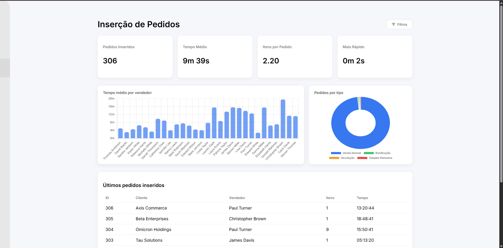
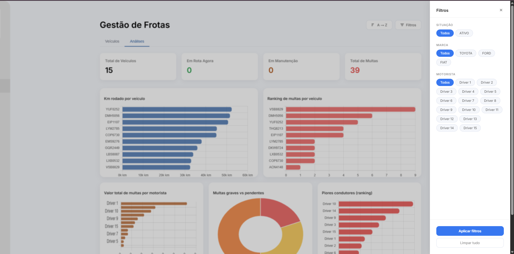
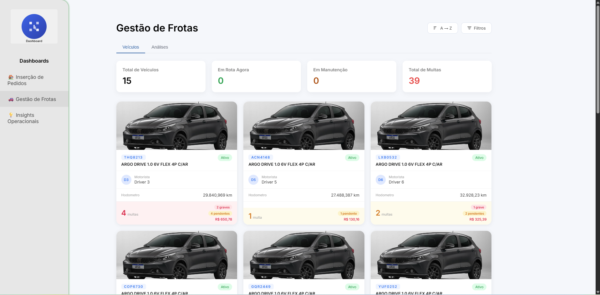
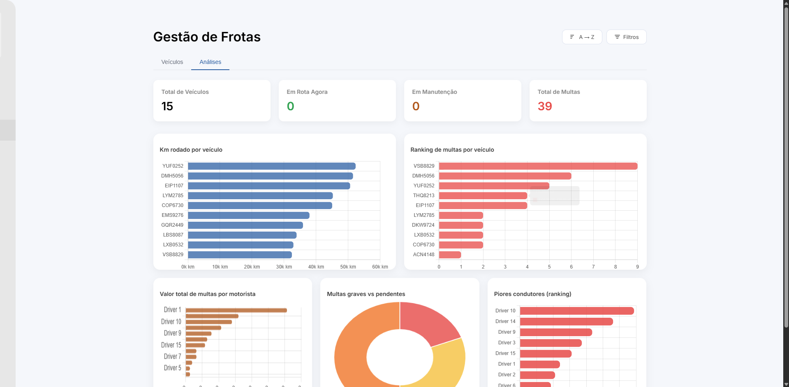
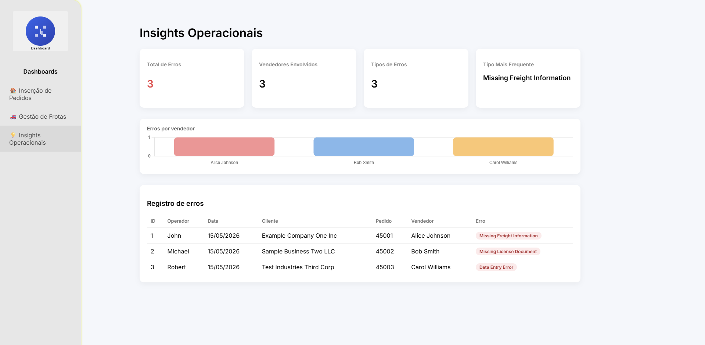

#  OpsView — Dashboard de Inteligência Operacional

> Plataforma web de dashboards interativos desenvolvida para centralizar e visualizar dados operacionais de vendas e logística, permitindo tomada de decisão mais rápida por gestores comerciais e de frota.

---

##  Motivação

Os dados operacionais existiam dispersos em planilhas Excel sem uma forma visual e centralizada de interpretá-los. O OpsView foi criado para transformar esses dados em painéis interativos, oferecendo visibilidade em tempo real sobre pedidos, desempenho de vendedores e gestão da frota de veículos.

---

##  Módulos

###  Inserção de Pedidos
Monitora a performance da equipe comercial na inserção de pedidos no sistema.

- Cards de KPI: total de pedidos inseridos, tempo médio, itens por pedido e recorde de velocidade
- Gráfico de barras com tempo médio por vendedor
- Gráfico de rosca com distribuição por tipo de pedido (Venda Normal, Bonificação, Devolução, Simples Remessa)
- Tabela com os últimos pedidos inseridos (cliente, vendedor, itens, tempo)
- Filtros por vendedor, tipo de pedido e período

---

###  Gestão de Frotas
Controle completo da frota de veículos da empresa.

- Cards de KPI: total de veículos, em rota agora, em manutenção e total de multas
- Grid de cards por veículo com foto, placa, motorista, hodômetro e multas (graves/pendentes)
- Gráfico de barras horizontais: km rodado por veículo
- Ranking de multas por veículo
- Gráfico de valor total de multas por motorista
- Gráfico de multas graves vs pendentes
- Ranking de piores condutores
- Ordenação A→Z e filtros avançados

---

### Insights Operacionais
Painel de rastreamento de erros operacionais para controle de qualidade nos pedidos.

- Cards de KPI: total de erros, vendedores envolvidos, tipos de erros e tipo mais frequente
- Gráfico de barras com erros por vendedor
- Tabela de registro de erros com operador, data, cliente, pedido, vendedor e tipo de erro com badge colorido por categoria (Missing Freight Information, Missing License Document, Data Entry Error, etc.)

---

##  Tecnologias

| Camada | Tecnologia |
|---|---|
| Frontend | HTML, CSS, JavaScript |
| Gráficos | Chart.js |
| Pipeline de dados | Python |
| Fonte de dados | Microsoft Excel (.xlsx) |
| Formato de troca | JSON |

**Fluxo de dados:**
```
Excel (.xlsx) → Python (extração) → JSON → Dashboard (HTML/JS)
```

---

##  Screenshots

### Inserção de Pedidos


### Inserção de Pedidos — Painel de Filtros


### Gestão de Frotas — Veículos


### Gestão de Frotas — Análises


### Insights Operacionais  

---

##  Impacto

- Eliminou a necessidade de analisar dados diretamente em planilhas Excel
- Centralizou informações de vendas e logística em um único painel visual
- Permitiu que gestores comerciais e de logística acessem indicadores de forma rápida e visual
- Identificação facilitada de gargalos operacionais (vendedores lentos, veículos com multas, etc.)

---

##  O que eu melhoraria

- Conexão direta com banco de dados ou ERP, eliminando a dependência do Excel
- Atualização automática dos dados em tempo real (WebSocket ou polling)
- Módulo de exportação de relatórios em PDF
- Autenticação por perfil de usuário (gestor, operacional, visualização)
- Deploy em servidor interno para acesso via navegador sem precisar rodar o pipeline manualmente

---

> Projeto desenvolvido para uso interno. O código-fonte não é publicado por questões de confidencialidade corporativa. Dados exibidos nos screenshots são fictícios ou anonimizados.
